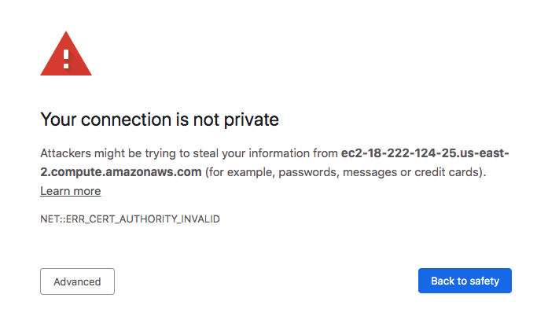
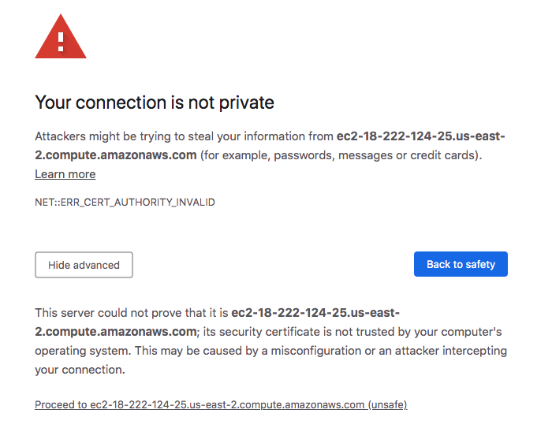

# Spark Workshop for Data Engineers - Pre training Safety Ckeck List

If you are seeing this, you are confirming your access to the Repo. 

- Make sure you are not behind a strict firewall and that all the following ports are open 
- Keep an eye on your antivirus as well, if you have one and experience connection issues (just force disable it) 

### Test URLs & Ports : 

- You should be able to access these URLs

EXAMPLE LINKS - DO NOT CLICK ON THE LINKS - USE YOUR SERVER IP

| HDFS Name Node | http://ec2-18-222-124-25.us-east-2.compute.amazonaws.com:9870/  |   
|---|---|
| Spark History Server  |  http://ec2-18-222-124-25.us-east-2.compute.amazonaws.com:18080/	 |   
| JupyterHub |  https://ec2-18-222-124-25.us-east-2.compute.amazonaws.com:9443/	 | 
| Zeppelin | http://ec2-18-222-124-25.us-east-2.compute.amazonaws.com:8890/  |
| Yarn | http://ec2-18-222-124-25.us-east-2.compute.amazonaws.com:8088/  | 
		
For some URLs you might have this message : 

On most browsers you can click on Advanced > Proceed

On Chrome however, there is an ugly hack :

    * Click a blank section of the denial page.
    * Using your keyboard, type thisisunsafe

Strange hack, but it works. 

### Test your SSH : 

- After that, Please proceed to [ssh testing](/shell/exercices/00-terminal.md)

- After that, you're done. 
